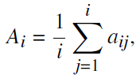
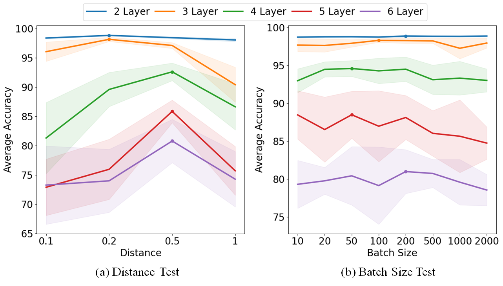
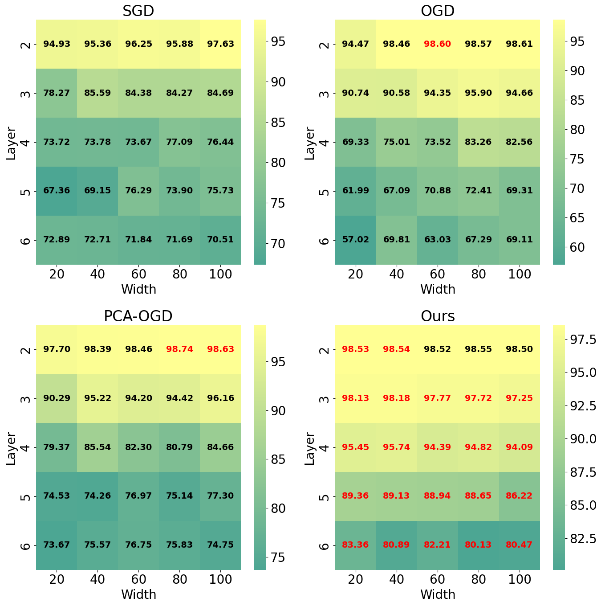
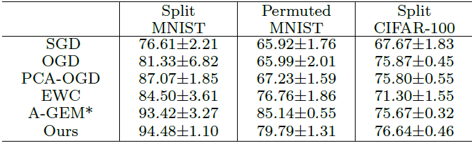

## Orthogonal Gradient Descent based Catastrophic Forgetting Loss

An Implementation of CF loss-based OGD for continual learning in PyTorch.

Paper Title: A Continual Learning Algorithm Based on Orthogonal Gradient Descent Beyond Neural Tangent Kernel Regime

Journal: IEEE Access (Accepted at 30 Jul 2023, to be published soon)

Author: Da Eun Lee, Kensuke Nakamura, Jae-Ho Tak, and Byung-Woo Hong

Affiliation: Department of Artificial Intelligence, Chung-Ang University, Seoul, Korea

## Experiments

The experiments have done on Split-MNIST, Permuted-MNIST, Split-CIFAR100.

The experimental results are presented below.

The numbers in the results represent the average accuracy, which is a common metric widely used in continual learning as follows:
<p align="center">
  
</p>
where a_ij is the accuracy of the j-th test set after completing the learning of the i-th training set.


1. Characteristic Investigation
<p align="center">
  
</p>

2. Architectural Investigation
<p align="center">
  
</p>

3. Comparative experiments
<p align="center">
  
</p>

## How to use

Run 'script.sh' file as follows:
```
bash script.sh
```
Please uncomment the line you want to run.

You may need to download the benchmark datasets at the designated path before running.

Check various options in the script file for other experimental setups.
